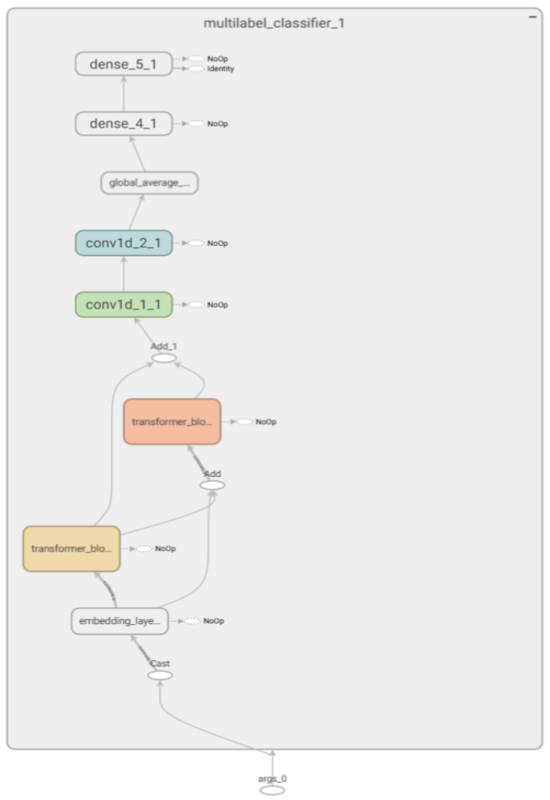
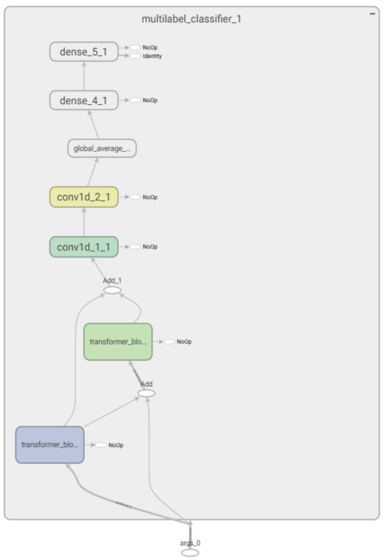

<h1 >AIProject – Transformer-based Text Classification</h1>

<p  style="font-size: 14px; line-height: 1.6;">
  Welcome to <strong>AIProject</strong> — a deep learning pipeline designed for robust and scalable multi-label text classification using custom Transformer architectures built in TensorFlow.<br>
  The system is engineered with a modular design, YAML-based configuration, and full GPU acceleration (RTX 4090) to enable efficient training, experimentation, and inference workflows.
</p>

---

<h1 >Model Architecture & Configuration </h1>

<p  style="font-size: 14px; line-height: 1.6;"><i>(Two-layer Transformer with residual connections)</i></p>
<p style="font-size: 14px; line-height: 1.6;">This model is composed of **two Transformer encoder blocks connected in series**, enhanced with **skip connections** (residual paths) inspired by architectures like *ResNet*, 
adapted to the NLP domain. These connections help preserve gradient flow and retain low-level information across layers.

</p>

---
<h1 >Embedding Modes</h1>

<p style="font-size: 14px; line-height: 1.6;">
  A unique feature of the system is the ability to choose between two embedding strategies:
</p>

<ul style="font-size: 14px; line-height: 1.6;">
  <li>
    <strong>BERT Embedding</strong>: Uses <code>TFBertModel</code> from HuggingFace to produce context-aware embeddings
    where each token's meaning adapts based on the surrounding words.<br>
    <em>Impact:</em> Significantly improves classification performance, especially on complex or ambiguous texts, 
    but increases training time and memory usage.
  </li>
  <br>
  <li>
    <strong>Standard Embedding</strong>: Uses a classic <code>tf.keras.layers.Embedding</code> layer, 
    where each word is mapped to a fixed dense vector.<br>
    <em>Impact:</em> Faster and lighter to train, but lacks dynamic contextualization of meaning.
  </li>
</ul>

---
<h1 >Dataset</h1>

<p style="font-size: 14px; line-height: 1.6;">
  The main dataset used for this project is the <strong>MNDS (Multinational News Dataset)</strong>, a curated multilingual corpus of news articles labeled by topic. 
  It contains thousands of samples grouped into categories such as <em>climate change, politics, sports, economy</em>, and more.
</p>

<p style="font-size: 14px; line-height: 1.6;">
  The data is preprocessed and split into <code>train/validation/test</code> sets. It is stored in the <code>data/</code> folder as both raw CSV files and processed JSON format suitable for fast loading and tokenization.
</p>

<p style="font-size: 14px; line-height: 1.6;">
  The multi-label nature of the dataset makes it ideal for evaluating models on complex text classification tasks where a single document can belong to multiple categories.
</p>

---
<h1 >Model Diagram</h1>

|            *Bert Embedding*             |            *Standard Embedding*             |
|:---------------------------------------:|:-------------------------------------------:|
|  |  |


<p style="font-size: 14px; line-height: 1.6;">
  The diagram above illustrates the architecture of the custom Transformer model used in this project. 
  The model consists of <strong>two Transformer encoder blocks</strong> arranged in sequence, each followed by <strong>residual skip connections</strong> to preserve information and aid gradient flow.
</p>

<p style="font-size: 14px; line-height: 1.6;">
  The input text is first embedded using either a pre-trained BERT model or a learnable embedding layer. 
  The resulting sequence is then processed by the encoder layers, whose outputs are aggregated and passed to a fully connected classification head.
</p>

<p style="font-size: 14px; line-height: 1.6;">
  This architecture is designed to balance expressiveness with training efficiency, enabling robust classification on a variety of news topics.
</p>


---

<h1 >Hardware Used</h1>

<ul>
  <li><strong>GPU</strong>: NVIDIA GeForce <strong>RTX 4090</strong></li>
  <li><strong>VRAM</strong>: 24 GB GDDR6X</li>
  <li><strong>CUDA</strong>: 12.1 + cuDNN</li>
  <li><strong>Precision</strong>: Mixed FP16/32 training</li>
  <li><strong>Environment</strong>: Python 3.10, TensorFlow 2.x</li>
</ul>

---

<h1 >Curiosities</h1>

<ul style="font-size: 14px; line-height: 1.8;">
  <li>
    The <strong>NVIDIA RTX 4090</strong> features over <strong>16,000 CUDA cores</strong> and is capable of over <strong>82 teraflops</strong> of FP32 compute performance, making it ideal for training large-scale deep learning models.
  </li>
  <li>
    Thanks to <strong>Tensor Cores</strong>, mixed-precision training (float16 + float32) speeds up training and allows larger batch sizes to fit in memory.
  </li>
  <li>
    The use of <strong>residual connections</strong> in NLP is inspired by their success in CNNs (e.g. ResNet) and helps prevent degradation in deeper models.
  </li>
  <li>
    The Transformer architecture was introduced in 2017 with the seminal paper <em>"Attention is All You Need"</em>, and it has since become the backbone of modern NLP.
  </li>
  <li>
    Unlike image classification, <strong>text classification</strong> often requires handling multiple labels per document—making Transformers particularly suited due to their ability to capture long-range dependencies.
  </li>
</ul>


---

<h1 > How to Run</h1>

Install dependencies:

```bash
   pip install -r requirements.txt
```

Train the model:

```bash
   python scripts/train.py
```

Run inference:

```bash
   python scripts/predict_file.py --input data/input_to_infer.txt
```

---
<h1 > Project Structure</h1>

```
AIProject/
    ├── Hello_GPU_World.py
    ├── README.md
    ├── config
    ├── data
    │    ├── processed
    │    └── raw
    ├── docs
    ├── logs
    ├── requirements.txt
    ├── scripts
    ├── src
    │    ├── data
    │    ├── logs
    │    │    ├── launch_tensorboard.sh
    │    │    └── tensorboard
    │    │            ├── bert_embedding
    │    │            └── standard_embedding
    │    ├── models
    │    │     └── data
    │    │          ├── bert_embedding
    │    │          └── standard_embedding
    │    └── utils
    ├── templates
    └── tests
```

---
## Author

Developed by **Pietro Manning** as part of a Master's thesis in Data Science – 2025.

## License

This project is licensed under the MIT License.